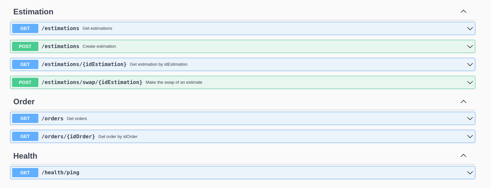
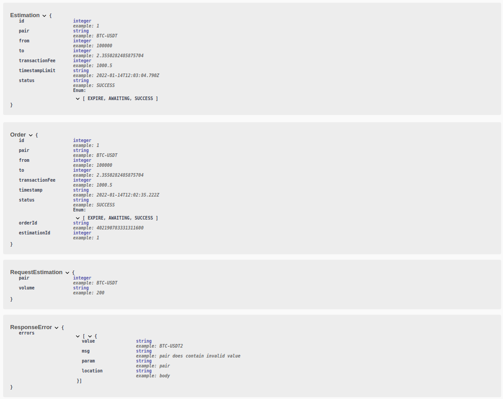
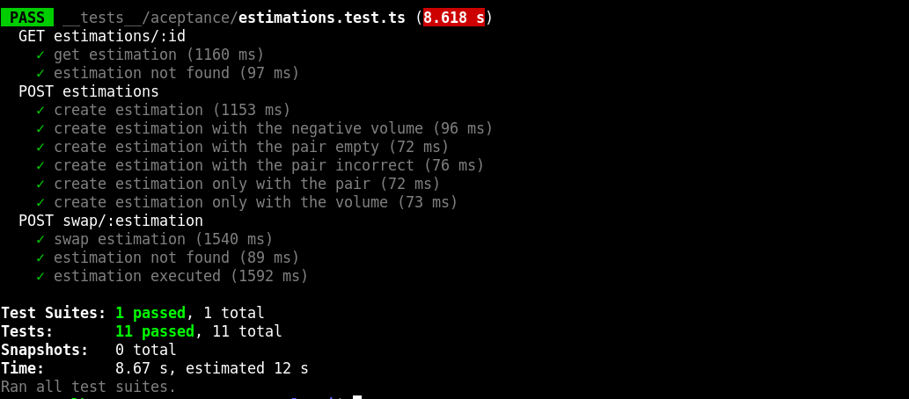

# Backend challenge Belo

## Consigna

`https://belo.notion.site/Backend-challenge-69636c4f0a5f4a12881a85194a969263`

## Resumen

Podemos crear estimaciones y ejecutar órdenes en la plataforma Okex. El flujo es el siguiente:
- Crear una estimación con un par y un monto.
- Se genera una estimación, la cual nos da un aproximado del valor que vamos a recibir ya descontando todos los fees.
- La estimación tiene un tiempo de expiración en el cual si no se ejecuta queda en estado expirada.
- Ahora si queremos comprar lo que nos ofreció la estimación deberemos ejecutar el swap pasando el idEstimacion.
- Se genera una orden en la cual está el par y monto que queremos comprar. Esto nos retornará un idOrden.
- Ya realizado el swap podemos consultar nuestra orden con el idOrden y obtendremos el monto que recibimos realmente, además tenemos un orderIdOkex para ir a ver la compra realizada en su plataforma.

## Prerequisitos

-   nodeJS
-   docker

## Instalación

1. `git clone https://github.com/dpinones/api-belo-app.git`
2. `npm i`
3. `docker compose up -d`
4. `cp .env.local .env`
5. Cargar credenciales en el archivo .env
6. `npm run dev`

## Otros comandos

Ejecutar los test

```shell
npm run test
```

Ejecutar el linter

```shell
npm run lint
```

Ejecutar prettier

```shell
npm run prettier
```

## Variables de entorno

-   FEE_BELO = porcentaje del fee de Belo
-   SECOND_CUSTOM = segundos para que una estimacion expire
-   ENVIROMENT = DEVELOPMENT || PRODUCTION

## Swagger

Url: `http://localhost:3005/docs/`

Endpoints



Modelo



## Test



## Aclaraciones

-   Okex dispone de un ambiente de pruebas. Obtener las credenciales para poder probar la api.
-   Al operar con su dinero real debe cambiar el enviroment a PRODUCTION. Recuerde que okex tiene distintas credenciales por ambiente. Por lo tanto, también debería cambiar las credenciales.
-   Para realizar pruebas sobre la api en la raíz se encuentra una postman colección para importar la cual contiene todos los endpoint disponibles.
